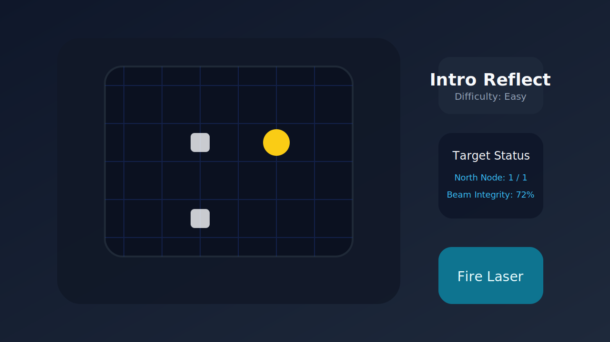

# Laser Game

Ein modernes Laser-Puzzlespiel mit reflektierenden Spiegeln, aufteilenden Prismen, energiehungrigen Feldern und zerstörbaren Hindernissen. Dieses Paket bündelt die Spiellogik, Leveldaten, Assets und Tests – inklusive neuer Bomben-Mechanik, verstellbarer Laserhelligkeit und gepulster Simulation – sodass du sofort mit dem Bauen einer Desktop- oder Web-Variante starten kannst.



## Inhalt

- `game.py`: Kernlogik für Laserphysik, Levelverwaltung und Lösungskontrolle.
- `levels/`: JSON-Dateien mit Levelgeometrie, Metadaten und Spezialobjekten (u. a. `level_bombastic_gauntlet.json`, `level_prismatic_forge.json`, `level_crystal_catacombs.json`, `level_pulse_maelstrom.json`, `level_superluminal_chorus.json`, `level_endless_resonator.json`, `level_cataclysm_chain.json`).
- `solutions/`: Automatisiert prüfbare Mustersolutions pro Level.
- `assets/`: SVG-Sprites für Raster, Spiegel, Ziele, UI und Mockups.
- `tests/`: Unit- und Integrationstests für Spiegelverhalten, Levelabschluss und Solution-Validierung.
- `demo.py`: Konsolen-Demo, die ein Level lädt, eine Mustersolution anwendet und die Ergebnisse der Simulation ausgibt.

## Voraussetzungen & Installation

Das Projekt benötigt Python 3.10 oder höher. Optional kannst du `pygame` installieren, falls du auf Basis dieser Logik eine UI entwickeln möchtest.

```bash
python -m venv .venv
source .venv/bin/activate
pip install pytest pygame
```

## Ausführung

Starte die Konsolen-Demo, um das Laser-System mit der Mustersolution des Einstiegslevels zu simulieren:

```bash
python -m laser_game.demo
```

Die Demo lädt `level_intro`, wendet die hinterlegte Mustersolution an und gibt die Energieverteilung sowie die simulierten Strahlsegmente aus. Diese Ausgabe eignet sich hervorragend als Basis für Debugging, Telemetrie oder UI-Overlays.

### UI-Start

Die optionale Desktop-Oberfläche benötigt zusätzlich zu den Kernabhängigkeiten ein SDL-Backend:

```bash
pip install pygame python-dotenv
```

Konfiguriere anschließend die Pfade für Assets und Level-Dateien. Standardmäßig nutzt die UI die paketinternen Verzeichnisse, über Umgebungsvariablen kannst du jedoch eigene Inhalte laden:

```bash
export LASER_GAME_ASSET_ROOT="$(pwd)/laser_game/assets"
export LASER_GAME_LEVEL_ROOT="$(pwd)/laser_game/levels"
```

Das Setzen dieser Variablen lässt sich bequem in einer `.env`-Datei speichern und über `python-dotenv` einlesen. Danach startest du die Oberfläche per:

```bash
python -m laser_game.ui.main
```

Der Befehl öffnet direkt das interaktive Fenster und blendet vorab die aufgelösten Verzeichnisse im Terminal ein. Möchtest du nur diese Information abfragen, kannst du stattdessen `python -m laser_game.ui.main --info` verwenden.

Beim Start landest du auf dem „Story-Dashboard“. Von dort gelangst du mit `Enter` oder `Leertaste` (bzw. dem Button „Mission starten“) ins eigentliche Spiel.

### Modernes Pulse-Interface

- Raster, Sidebar, Header und Footer sind in Glas-/Neon-Optik gestaltet und wachsen mit der Fenstergröße mit (`F11` schaltet in den Vollbildmodus, Fenster ist über die Ecken frei skalierbar).
- Die Werkzeugleiste im rechten Panel erlaubt nun das Platzieren von Spiegeln, Splittern (Dual/Triple), Amplifiern und Bomben – alles mit einem Klick. Rechtsklick entfernt existierende Elemente.
- Pulsanimationen laufen als leuchtende Glows über das Raster, Explosionen haben einen Partikel-Effekt und Ziele leuchten erst, sobald sie real Energie erhalten.
- Score-, Combo- und Punkte-Historie sitzen im Header; nach einem gewonnenen Level blendet eine Celebration-Folie auf und belohnt dich mit Bonuspunkten.
- Die Steuerungshilfe blendet sich nach einigen Sekunden automatisch aus und kann jederzeit per `H` wieder eingeblendet werden.
- `SPACE` startet einen Pulse, `←/→` oder `N/P` wechseln die Level, `F11` toggelt den Vollbildmodus.

- Die Sidebar zeigt farbcodierte Energie-Balken je Ziel und eine Legende der Energiestufen.
- Neue Partikeleffekte und farbige Pulse-Köpfe visualisieren die aktuelle Energie des Strahls.
- Spiegelrotationen werden nach einer Platzierung kurz gesperrt; der Footer weist darauf hin (Taste `R` zum Freigeben).

## Steuerungskonzept für eine UI

Die Logik ist so aufgebaut, dass ein modernes Interface (z. B. mit Pygame, pyglet oder einer WebCanvas-Engine) lediglich folgende Interaktionen abbilden muss:

1. **Level-Auswahl** über die Metadaten (`name`, `difficulty`).
2. **Platzierung von Elementen**: Mirrors, Splitters, Amplifier, Bomben und Energiefelder werden als Platzierungen mit Position, Typ und Parametern (`orientation`, `pattern`, `multiplier`, `drain`, …) injiziert.
3. **Simulation auslösen** mittels `LaserGame.propagate()` und Visualisierung der zurückgegebenen Strahlsegmente (`BeamSegment`).
4. **Erfolgsprüfung** via `LaserGame.level_complete()` bzw. `SolutionValidator.validate()` für Mustersolutions oder Nutzerlösungen.

### Interaktionsabläufe

- **Platzieren**: Klone das `Level` (z. B. per `copy.deepcopy`) oder arbeite mit einem transaktionalen State-Objekt, ergänze das jeweilige Dict (`mirrors`, `prisms`, `energy_fields`) und triggere direkt im Anschluss `propagate()`, um das Feedback zu visualisieren.
- **Undo**: Bewahre den Zustand der Platzierungs-Queue auf (z. B. als Stack) und nutze `LevelLoader.load()` in Kombination mit den verbliebenen Platzierungen, um eine konsistente Rücknahme zu gewährleisten.
- **Levelwechsel**: Räume vor dem Laden eines neuen Levels sämtliche temporären Objekte, setze deine UI-State-Maschine zurück und initialisiere die `LaserGame`-Instanz erneut. So verhinderst du, dass Strahlsegmente oder Zielenergien des vorherigen Levels sichtbar bleiben.

## Level-Format

Jede Leveldatei ist eine JSON-Struktur mit folgenden Feldern:

```json
{
  "name": "Intro Reflect",
  "difficulty": "Easy",
  "width": 6,
  "height": 6,
  "emitters": [
    {"position": [0, 3], "direction": "EAST", "energy": 10, "brightness": 1.0}
  ],
  "targets": [
    {"position": [4, 1], "required_energy": 1, "label": "North Node"}
  ],
  "mirrors": [
    {"position": [3, 3], "orientation": "/"}
  ],
  "prisms": [
    {"position": [3, 4], "spread": 1}
  ],
  "energy_fields": [
    {"position": [5, 4], "drain": 1, "color": "magenta"}
  ],
  "obstacles": [
    {"position": [2, 3], "durability": 2, "destructible": true}
  ],
  "bombs": [
    {"position": [1, 3], "power": 1}
  ]
}
```

- **Positionen** werden im Raster (x, y) angegeben, beginnend bei `(0, 0)` in der oberen linken Ecke.
- **Emitter** definieren Startposition, Ausrichtung (`NORTH`, `EAST`, `SOUTH`, `WEST`), die Energiereserve sowie optional die Laserhelligkeit (`brightness`).
- **Targets** geben an, wie viele Energieeinheiten das Ziel absorbieren muss.
- **Mirrors** nutzen `"/"` oder `"\\"` zur Orientierung.
- **Prisms** erzeugen aus einem Strahl mehrere (vorwärts, links, rechts).
- **Energy Fields** ziehen pro Durchgang `drain` Einheiten ab; ist die Energie aufgebraucht, stoppt der Strahl.
- **Obstacles** blockieren den Strahl, bis ihre Haltbarkeit (`durability`) durch Bomben oder wiederholte Treffer erschöpft ist.
- **Bombs** zerstören beim Kontakt Hindernisse innerhalb ihres Radius (`power`) und hinterlassen Explosionseffekte für die UI.
- **Splitters** (`splitters`) teilen den Puls in mehrere Richtungen – dual, triple oder cross.
- **Amplifiers** erhöhen die Energie/Intensität (`multiplier`, optional `additive`, `cap`) und ermöglichen Loop-basierte Highscores.

### Neue Levelpakete

Die erweiterten Level (`level_bombastic_gauntlet`, `level_prismatic_forge`, `level_crystal_catacombs`, `level_pulse_maelstrom`, `level_superluminal_chorus`, `level_endless_resonator`, `level_cataclysm_chain`) verlangen gezielten Einsatz von Splittern, Amplifiern und Bomben. Die jeweiligen Lösùungen zeigen Beispiel-Platzierungen, können aber natürlich überboten werden.

- **Endless Resonator**: Kompaktlevel mit Pflicht-Loop, Verstärker-Überladung und klarer Energieskala.
- **Cataclysm Chain**: Mehrstufiges Bombenszenario, das nacheinander Barrieren sprengt und den Loop zündet.

 (`level_bombastic_gauntlet`, `level_prismatic_forge`, `level_crystal_catacombs`, `level_pulse_maelstrom`, `level_superluminal_chorus`) verlangen gezielten Einsatz von Splittern, Amplifiern und Bomben. Die jeweiligen Lösungen zeigen Beispiel-Platzierungen, können aber natürlich überboten werden.

## Mustersolutions

Für jedes Level existiert eine JSON-Datei in `solutions/`, die zusätzliche Platzierungen sowie erwartete Zielenergien beschreibt. Beispiel (`solutions/level_intro.json`):

```json
{
  "placements": [
    {"type": "mirror", "position": [3, 3], "orientation": "/"},
    {"type": "mirror", "position": [3, 1], "orientation": "/"}
  ],
  "expected_targets": {
    "(4, 1)": 1
  }
}
```

Die `SolutionValidator`-Klasse wendet diese Platzierungen an, simuliert die Laser-Physik und vergleicht die gemessenen Zielenergien mit den erwarteten Werten. So lässt sich jede neue Level- oder Gameplay-Änderung sofort validieren.

## Tests

Die Tests decken Spiegelreflexionen, Levelabschlüsse und Solution-Validierung ab und können mit Pytest ausgeführt werden:

```bash
pytest laser_game/tests
```

Die Integrationstests laden die echten Level- und Solution-Dateien und sichern so das Zusammenspiel der JSON-Daten mit der Kernlogik.

Für die neue UI-Starthilfe existieren zusätzliche Smoke-Tests (`laser_game/tests/test_ui_main.py`). Führe sie separat aus, wenn du Änderungen am UI-Bootstrap oder den Umgebungsvariablen vornimmst:

```bash
pytest laser_game/tests/test_ui_main.py
```

So stellst du sicher, dass lokale Anpassungen an Asset- oder Level-Pfaden weiterhin korrekt aufgelöst werden.

## Beitragshinweise für Assets & Level-JSONs

- **Assets**: Lege neue Grafiken als SVG in `assets/` ab, halte Größe und Ursprung konsistent (Rastergröße 128 px) und dokumentiere Varianten (z. B. aktive/inaktive Ziele) im Dateinamen. Bewahre Rohdaten (z. B. `.afdesign`, `.fig`) außerhalb des Repos auf und exportiere optimierte SVGs ohne unnötige Metadaten.
- **Level-JSONs**: Verwende sprechende Dateinamen (`level_<thema>.json`), erhöhe die `difficulty`, sobald neue Mechaniken eingeführt werden, und prüfe jede Änderung mit `SolutionValidator.validate()`. Achte darauf, dass Koordinaten integer sind, Zielenergien mit den Mustersolutions übereinstimmen und optionale Felder (`color`, `label`) gepflegt werden.
- **Validierung**: Ergänze zu neuen Leveln immer eine passende Datei in `solutions/`, aktualisiere betroffene Tests und dokumentiere Besonderheiten (z. B. simultane Ziele) in den Level-Metadaten.

## Weiterentwicklung

- **UI-Integration**: Kopple `LaserGame.playthrough()` mit einer Pygame-Loop, die Sprites aus `assets/` zeichnet und Interaktionen entgegennimmt.
- **Level-Editor**: Erstelle ein Tool, das Rasterobjekte per Drag & Drop setzt und direkt JSON plus Mustersolution exportiert.
- **Analytics**: Nutze die Strahlsegmente (`BeamSegment`) für Heatmaps oder Wiederholungen.

Viel Spaß beim Experimentieren mit Licht, Spiegeln und Energie!
